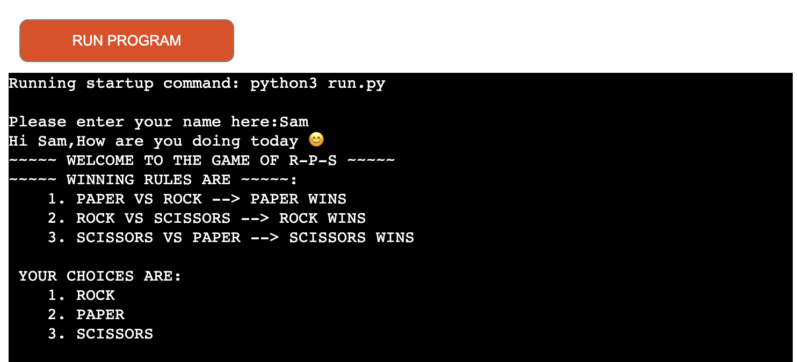
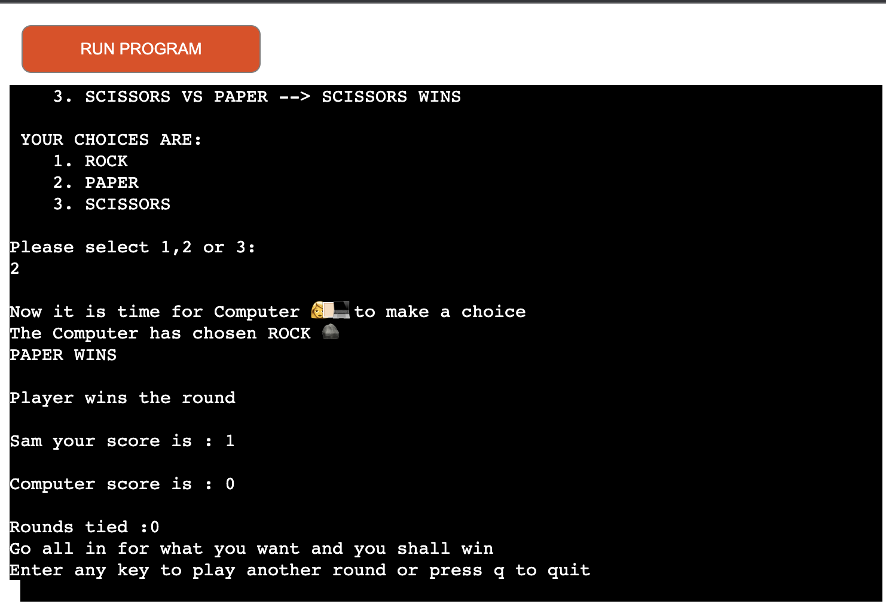
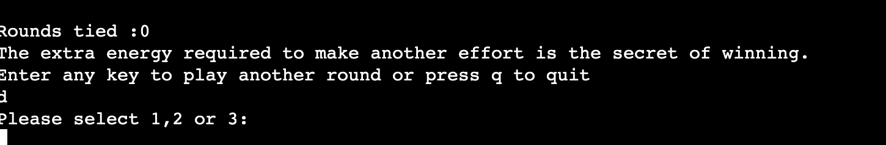
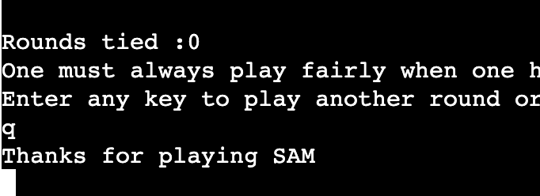
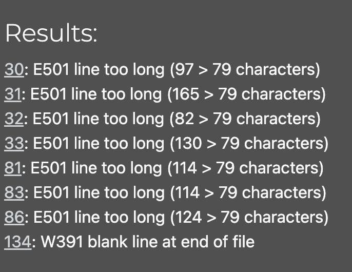

# Rock Paper and Scissors (https://r-p-s-python.herokuapp.com/) 

Rock paper and scissors is a fun, exciting and surprisingly easy game that runs in the Python mock terminal on Heroku.

A user can challenge the computer for a game of rock, paper and Scissors,
Almost everyone knows the game, rules are simple: rock beat scissors, paper beats rock and scissors beats paper.
You can play the game with your rival, the computer for as long as you like or. Alternatively, you can also choose to 
quit the game (if you are tired of winning or losing ☺️)

## Features

The flow of the game consists of the following steps :
<li> Ask for the player’s Name.</li>
<li> Print the Welcome Message and winning rules.</li>
<li> Print the choices for the player.</li>
<li> Ask for the player’s choice as input(1,2,3).</li>
<li> Check if the input is a valid number, if not, repeat step 4 .</li>
<li> Print the (valid) player’s choice to the terminal.</li>
<li> Print the message for the computer’s turn.</li>
<li> The computer makes a choice.</li>
<li> Print the computer’s choice to the terminal.</li>
<li> Compare the user’s choice and the computer’s to determine the outcome(win/lose or tie).</li>
<li> Based on the outcome, Calculate the user’s score or the player’s score and print it to the terminal.</li>
<li> Print an encouraging message if the user wins/loses the round.</li>
<li> One each round of the game, ask if the player wants to play again or quit the game. </li>
<li> If the user chooses to exit the game. Stop the game.</li>
<li> Print thank you for playing to the terminal.</li>
<li> Else, start the game again for the player.</li>
 

## What will be used to make the game 

The following are used to make the game possible:
<li> Conditional Loops </li>
<li> Functions </li>
<li> While Loops for restarting the game and checking invalid response </li>
<li> Random module for random.randint and random.choice. </li>
 

## User Stories

<li>The user can input their name at and as soon as the user inputs their name they can see the welcoming message and read the winning rules of the game. </li>
<li> The user can also see the choices available to him/her. </li>

<li> The user can input their choice (1,2 or 3). Incase, the user inputs a number which doesn't match the requirement, 
the user will be reminded of his/her invalid response.</li>

<li> As the game progresses the scores increment, if the user wins the round or if the computer wins the round or if it's a tie. This way the user is always in the know of the overall score</li>

<li> The user has always has an option to continue the game. The user is served with a nice encouraging message every time they win </li>

<li> Alternatively, the user also has the option to quit the game whenever they want. Upon choosing this option a Thankyou message will be shown on the terminal </li>

 

## Testing

<li> After passing the code through the CI Python Linter :
The following errors were found upion final testing:

<li> Gave invalid inputs as user multiple time to check the error was handled efficiently and correctly without throwing errors. </li>
<li> Tested the game thoroughly on Gitpod terminal and Heroku Terminal for errors.
 
 

## Bugs

<li> There were many bugs found during the in the making of the game.</li>
<li> The main bug was that computer score was not incrementing because there was a a syntax problem in the outcome variable.</li>
<li> The while loop was not implemented correctly and kept breaking the game and started game at wrong starting points. </li>
<li> Indentation errors kept breaking the code.</li>
<li> The computer score/player score wasn't incrementing initially after each round. After starting a second round the scores would start fresh </li>
<li> Please Note : All the above bugs have been fixed. The game thankfully runs smoothly.</li>
 
 

## Deployment 

This project was deployed using Code Institute's mock terminal for Heroku, wish was provided by the code institute python-essentials-template.

Steps taken for deployments:

<li>Create a new Heroku app</li>
<li>added config var(PORT, 8000)</li>
<li>Set the buildbacks to Python and NodeJS in that order</li>
<li>Link the Heroku app to the repository</li>
<li>Enabled manual deployment from main</li>
<li>Click on Depoly</li>
 
 

## Credits

<li>I would like to thank my mentor Mr. Jack Wachira for challenging me to think about various aspects of the game and building a better game.</li>
<li> I would like to thank my husband Mr. Dushyant Sabharwal for his support and inputs/feedbacl on the game which also led to a better outcome </li>
<li> Also, thankyou to realpython.com from where I understood the flow of the game. </li>
<li> All the code for this game is written solely by me. </li>

